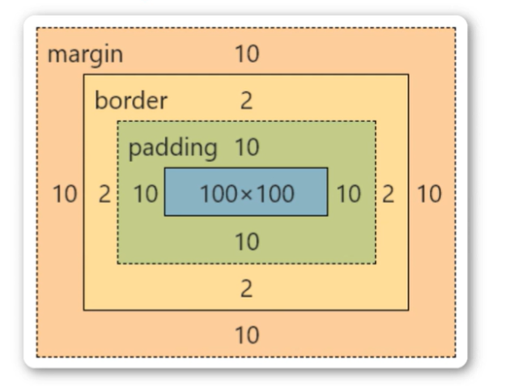

<h3>基本定义</h3>
1.css（cascading style sheets）层叠样式表,又叫级联样式表,简称样式表,属于网页的变美指南,即用于html文档中元素样式的定义<br />
2.文件后缀.css <br />
3.css规则:选择器+一条或者多条声明（样式）
```
选择器{属性:值;属性:值;  }
```


<h4>内联样式（行内样式）</h4>
```
<body>
    <p style="color:red;font-size=30px">xxxx</p>
</body>
```
<h4>内部样式（可以为所有的p标签添加同样的样式）</h4>
```
<head>
    <style>p{color:red,font-size=30px}</style>
</head>
```
<h4>外部样式（最推荐）</h4>

独立创建一个.css文件

.css文件中
```
p{color:red,font-size=30px}
```
.html中 
```
<head>
    <link rel="stylesheet" href="./public.css">
</head>
```
<h3>选择器</h3>
<em>选择器权重:</em><br />
元素选择器的权重为:1<br />
class选择器的权重为:10<br />
id选择器的权重为: 100<br />
内联样式的权重为:1000<br />
<em>优先级从高到低:</em> <br />
行内样式>ID选择器>类选择器>元素选择器

<h4>全局选择器</h4>
*代表通配符
```
<head>
*{
	color=red
	font-size=30px
}
</head>
```
<h4>元素选择器</h4>

```
<body>
    <p>物极<span>必反</span></p>
</body>
```
```
<head>
    span{}
</head>
```


<h4>类选择器</h4>

想要选择某一类p标签所使用的方法
```
<body>
    <p class="content size ">我不emo</p>
</body>
```
在<head></head>主体中添加来单独定义样式
```
<head>
    .content{}
    .size{}
</head>
```


<h4>ID选择器</h4>

用#定义
```
<body>
    <p id="text">Hello</p>
</body>
```
```
<head>
    #test{}
</head>
```
和class不一样的点在于id是独特的只有一个的


<h4>合并选择器</h4>
```
<head>
    p,h3{}
</head>
```


<h4>字体属性</h4>

<b>1.color</b>

```
<style>
    div{color:red;}

    div{color:#ff0000;}

    div{color:rgb(255,0,0);}

    div{color:rgba(255,0,0,.5);}
</style>
```

<b>2.font-size</b>
```
<style>
hl {font-size:40px;}

h2 {font-size:30px;}

p {font-size:14px;}
</style>
```

<b>3.font-weight</b>

<em>设置文本的粗细</em><br />
bold 定义粗体字符<br />
bolder 定义更粗的字符<br />
lighter 定义更细的字符<br />
100~900 定义由细到粗 400等同默认,而700等同于bold<br />

<b>4.font-style</b>

指定文本的字体样式<br />
normal 默认值<br />
italic 定义斜体字<br />

<b>5.font-family</b>

指定一个元素的字体<br />
font-family:"Microsoft",YaHei","simsun","simHei"


<h4>背景属性</h4>

background-color 设置背景颜色<br />

background-image 设置背景图片<br />

background-position 设置背景图片显示位置<br />

background-repeat 设置背景图片如何填充<br />

background-size 设置背景图片大小属性<br />

<b>1.background-color属性</b>

该属性设置背景颜色<br />
```
<body>
    <div class="box'></div>
</body>
```

```
<head>
    .box{
    width: 300px;
    height: 300px;
    background-color: palevioletred;
}
</head>
```
<b>2.background-image属性</b>
设置元素的背景图像<br />
元素的背景是元素的总大小,包括填充和边界(不包括外边距)。默认情况下background-image属性放置在元素的左上角,如果图像不够大的话会在垂直和水平方向平铺图像,如果图像大小超过元素大小从图像的左上角显示元素大小的那部分<br />
```
<body>
    <div class="box'>xxx</div>
</body>
```
```
<head>
    .box{
    width: 600px;
    height: 600px;
    background-image:url("images/imgl.jpg");
}
</head>
```

<b>3.background-repeat属性</b>

该属性设置如何平铺背景图像<br />

repeat 默认值<br />

repeat-x 只向水平方向平铺<br />

repeat-y 只向垂直方向平铺<br />

no-repeat 不平铺<br />
```
<head>
    .box{
    width:600px;

    height: 600px;

    background-color:#fcc:

    background-image:url("images/img1.jpg");

    background-repeat:no-repeat;
}
</head>
```


<b>4.background-size属性</b>

该属性设置背景图像的大小<br />

length 设置背景图片的宽度和高度,第一个值宽度,第二个值高度,如果只是设置一个,第二个值auto<br />

percentage 计算相对位置区域的百分比,第一个值宽度,第二个值高度,如果只是设置一个,第二个值auto<br />

cover 保持图片纵横比并将图片缩放成完全覆盖背景区域的最小大小<br />

contain 保持图片纵横比并将图像缩放成适合背景定位区域的最大大小<br />

<h4>文本属性</h4>

<b>1.text-align</b>

指定元素文本的水平对齐方式<br />
left 文本居左排列,默认值<br />
right把文本排列到右边<br />
center把文本排列到中间<br />

```
<style>
    h1 {text-align:center/left/right}
</style>
```

<b>2.text-decoration</b>

text-decoration 属性规定添加到文本的修饰下划线、上划线、删除线等<br />
underline 定义下划线<br />
overline 定义上划线<br />
line-through 定义删除线<br />
```
<style>
    h1 {text-decoration:overline/underline/line-through}
</style>
```

<b>3.text-transform</b>

控制文本的大小写<br />
captialize 定义每个单词开头大写<br />
uppercase 定义全部大写字母<br />
lowercase 定义全部小写字母<br />

<b>4.text-indent</b>

text-indent 属性规定文本块中首行文本的缩进
```
<style>
p{
    text-indent:50px;
}
</style>
```
负值是允许的。如果值是负数,将第一行左缩进

<h3>表格属性</h3>

<h4>1.表格边框</h4>

使用border属性
```
<style>
    table, td {
    border: lpx solid black;
}
</style>
```
<h4>2.折叠边框</h4>

border-collapse 属性设置表格的边框是否被折叠成一个单一的边框或隔开<br />
```
<style>
    table {border-collapse:collapse;}
    table,td {border: lpx solid black;}
</style>
```
<h4>3.表格宽度和高度</h4>

width和height属性定义表格的宽度和高度<br />
```
<style>
    table {width:100%;}
    td {height:50px;}
</style>
```
<h4>4.表格文字对齐</h4>

表格中的文本对齐和垂直对齐属性 <br />

text-align属性设置水平对齐方式:向左,右,或中心
```
<style>
    td {text-align:right;}
</style>
```
垂直对齐属性设置垂直对齐
```
<style>
    td {height:50px;vertical-align:bottom;}
</style>
```
<h4>5.表格填充</h4>

如果在表的内容中控制空格之间的边框,应使用ta和th元素的填充属性
```
<style>
    td {padding:15px;}
</style>
```
<h4>6.表格颜色</h4>

下面的例子指定边框的颜色,和th元素的文本和背景颜色
```
<style>
    table,td,th {border:1px solid green;}
    td {background-color:green;color:white;}
</style>
```
<h3>关系选择器分类</h3>

<em>1.后代选择器 E F{}</em>

<em>2.子代选择器E>F{}</em>

<em>3.相邻向下兄弟选择器E+F{}</em>

<em>4.通用向下兄弟选择器E~F{}</em>

<h3>css盒子模型(Box Model)</h3>

所有HTML元素可以看作盒子,在CSS中,"box model"这一术语是用来设计和布局时使用CSS盒模型本质上是一个盒子,封装周围的HTML元素
它包括:外边距(margin),边框(border),内边距(padding),和实际内容(content)


Margin(外边距)-清除边框外的区域,外边距是透明的(两个值:第一个值上下,第二个值左右)<br />
Border(边框)-围绕在内边距和内容外的边框<br />
Padding(内边距)-清除内容周围的区域(两个值:第一个值上下,第二个值左右)<br />
Content(内容)-盒子的内容,显示文本和图像<br />
```
<style>
div{
    width: 100px;
    height: 100px;
    background-color:red;
    padding-left: 50px;
    padding-right:100px;
    padding-top:150px;
    padding-bottom:40px;
    margin-right:50px;
    margin-left: 50px;
    margin-top:50px;
    margin-bottom:50px;
}
</style>
```
<h3>弹性盒子模型</h3>
弹性盒子是 CSS3 的一种新的布局模式<br />
CSS3 弹性盒是一种当页面需要适应不同的屏幕大小以及设备类型时确保元素拥有恰当的行为的布局
方式引入弹性盒布局模型的目的是提供一种更加有效的方式来对一个容器中的子元素进行排列、对齐和分配空白空间

<b>1.flex-direction</b>
row:横向从左到右排列(左对齐),默认的排列方式<br />
row-reverse:反转横向排列(右对齐,从后往前排,最后一项排在最前面<br />
column:纵向排列<br />
column-reverse:反转纵向排列,从后往前排,最后一项排在最上面<br />
```
<style>
.flex-container {
    display: flex;
    flex-direction:column;
    width: 400px;
    height: 250px;
    background-color: lightgrey;
}
</style>
```
<b><2.justify-content</b>

内容对齐(justify-content)属性应用在弹性容器上,把弹性项沿着弹性容器的主轴线(main axis)对齐<br />

flex-start 弹性项目向行头紧挨着填充。<br />
这个是默认值。第一个弹性项的main-start外边距边线被放置在该行的main-start边线,而后续弹性项依次平齐摆放<br />

flex-end 弹性项目向行尾紧挨着填充。<br />
第一个弹性项的main-end外边距边线被放置在该行的main-end边线,而后续弹性项依次平齐摆放<br />

center 弹性项目居中紧挨着填充。<br />
(如果剩余的自由空间是负的,则弹性项目将在两个方向上同时溢出)<br />


<b>3.aling-items</b>

设置或检索弹性盒子元素在侧轴(纵由)方向上的对齐方式<br />
flex-start 弹性盒子元素的侧轴(纵轴)起始位置的边界紧靠住该行的侧轴起始边界<br />
flex-end 弹性盒子元素的侧轴(纵轴)起始位置的边界紧靠住该行的侧轴结束边界<br />
center弹性盒子元素在该行的侧轴(纵轴)上居中放置。(如果该行的尺寸小于弹性盒子元素的尺寸,则会向两个方向溢出相同的长度)<br />

<b>子元素上的属性</b>

flex 根据弹性盒子元素所设置的扩展因子作为比率来分配剩余空间默认为0,即如果存在剩余空间,也不放大<br />
如果只有一个子元素设置,那么按扩展因子转化的百分比对其分配剩余空间。0.1即10%,1即100%,超出按100%<br />

<h3>文档流</h3>
文档流是文档中可显示对象在排列时所占用的位置/空间例如:<br />
块元素自上而下摆放,内联元素,从左到右摆放。<br />
标准流里面的限制非常多,导致很多页面效果无法实现

<h3>脱离文档流</h3>
使一个元素脱离标准文档流有三种方式:<br />
1.浮动<br />
2.绝对定位<br />
3.固定定位<br />

<b>1.浮动</b>
通过float属性定义元素在哪个方向浮动,任何元素都可以浮动,主要是两个元素之间就可以出现层叠的现象。
```
<style>
p{
	float:left/right
}
</style>
```
<b>清除浮动</b>
当元素设置float浮动后,该元素就会脱离文档流并向左/向右浮动,后续元素会受到影响<br />
1.父元素设置高度<br />
2.受影响的元素增加clear属性,clear:both<br />
3.overflow清除浮动 在父级元素style中增加overflow:hidden;clear:both<br />

<b>相对定位</b>
在style中设置position:relative<br />

left:200px  距离左边框200px<br />
top:200px  距离上边框200px<br />

<b>绝对定位</b>
在style中设置position:absolute<br />
left:200px  距离左边框200px<br />
top:200px  距离上边框200px<br />

<b>固定定位</b>
在style中设置position:fixed (固定定位不会随着页面的滚动而滚动)<br />
left:200px  距离左边框200px<br />
top:200px  距离上边框200px<br />
bottom<br />
right <br />

相对定位和绝对定位是相对于具有定位的父级元素进行位置调整的

<b>Z-index 设置堆叠顺序</b>
100图层会在50图层的上方
```
<style>
.box1{
    z-index:100,z-index:50
}
.box2{
    z-index:50
}
</style>
```


<h3>新特性</h3>

<b>1.圆角</b>
border-radius:属性<br />
写两个值,分别代表左上角、右下角和右上角和左下角<br />
写四个值,从左上角开始顺时针转<br />
```
<style>
.box{
    border-radius:20px/100 %
}
</style>
```

<b>2.阴影</b>
属性box-shadow :10px 10px 10px rgb(0,0,0,0.5)
h-shadow必选,水平阴影的位置
v-shadow 必选,垂直阴影的位置
blur可选,模糊距离
color可选,阴影的颜色
```
<style>
.box{
    width: 50px;
    height:50px;
    box-shadow :10px 10px 10px rgb(0,0,0,0.5)
}
</style>
```
<b>3.动画</b>
使元素从一种样式逐渐变化成为另一种样式的效果,规定变化的时间 from to or 0% 100%

```
<style>
.box{
    ……
    animation: name=myAnim duration timing-function delay iteration-count direction fill-mode;
}
</style>
```
再单独添加对动画的定义属性
```
<style>
@keyframes myAnim {
            0%{
                width: 200px;
                background-color: aliceblue;
            }
            50%{
                width: 500px;
                background-color: aquamarine  ;
            }
            100%{
                width: 200px;
                background-color: aqua;
            }
</style>
```
鼠标悬停
```
<style>
    div:hover{
	    animation-play-state:paused;
}
</style>
```
<b>4.媒体查询</b>
媒体查询会根据设备的大小自动识别和加载不同的样式
```
<style>
 @media screen and (max-width:768px){
            .box{
                background-color: burlywood;
            }   
        }
        @media screen and (min-width:768px) and (max-width:996px){
            .box{
                background-color:black;
            }
        }
        @media screen and (min-width:996px) {
            .box{
                background-color:blue;
            }
        }
</style>
```
<b>5.雪碧图 </b>
优点:减少图片的字节;减少网页的http请求,从而大大的提高页面的性能<br />
原理:通过background-image引入背景图片,通过background-position把背景图片移动到自己需要的位置<br />

<b>6.字体图标</b>
优点:轻量级别,减少http请求;灵活性,可以使用css来设置大小和颜色;兼容性:网页字体支持所有现代浏览器<br />

常用字体图标库 iconfont<br />

外联方式通过link引入css<br />
```
<head>
<link rel="stylesheet" href="./iconfont.css"
</head>
```
```
<body>
<span class="iconfont icon-xxx"></span>
</body>
```

