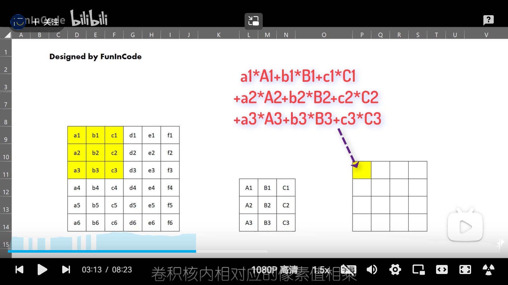
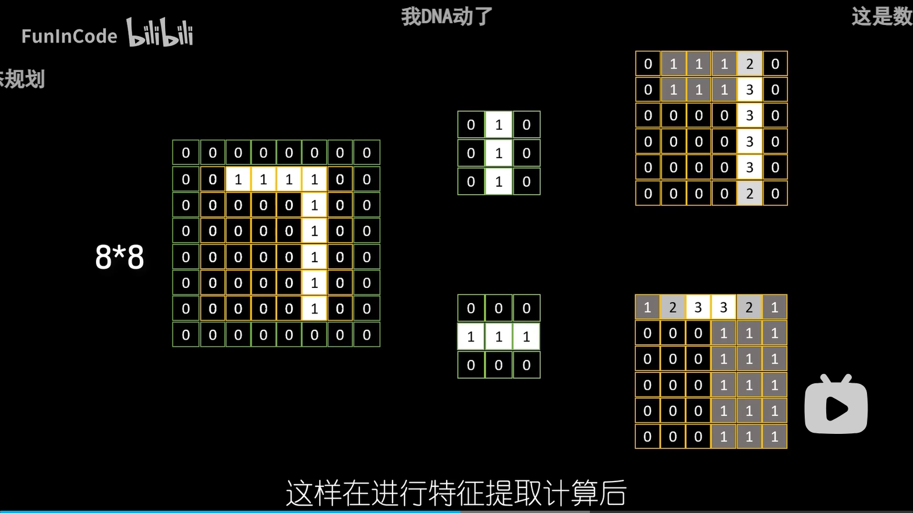
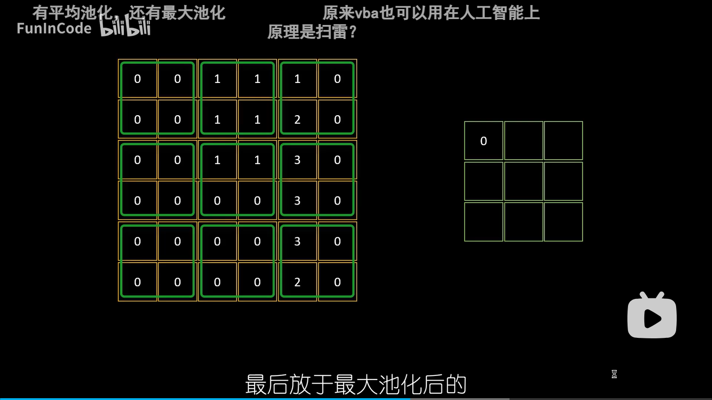

<!DOCTYPE html>
<html lang="en">
<head>
  <meta charset="UTF-8">
  <meta name="viewport" content="width=device-width, initial-scale=1.0">
  <title>Document</title>
</head>
<body>
  1.卷积核（特征过滤器） 3x3的像素图 

为了解决边缘特征的提取问题，要先通过padding的方法对像素图进行扩充。原始6x6，扩充后变8x8  

2.最大池化 
为了进一步压缩图像的特征，将卷积核提取的特征进行分割，选取每一块里面的最大值组成新的块
,会保留原始数据中最精华的部分

3.扁平化

</body>
</html>
